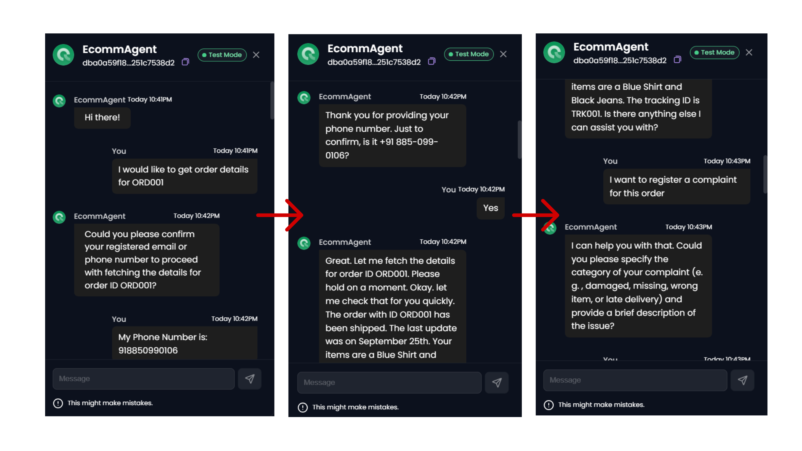
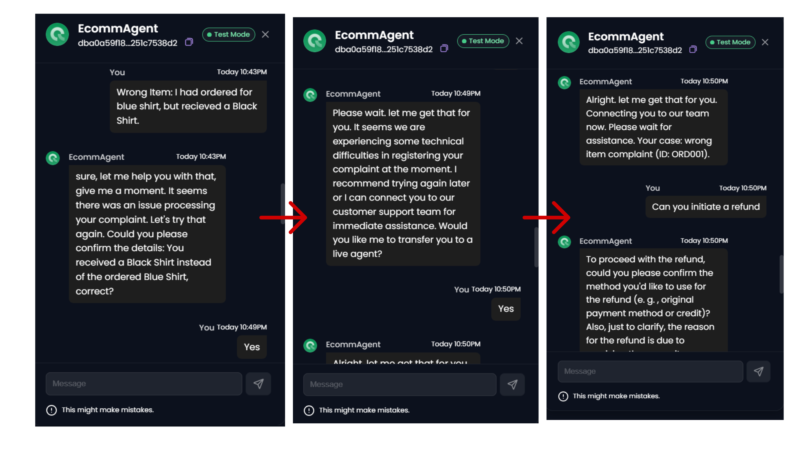
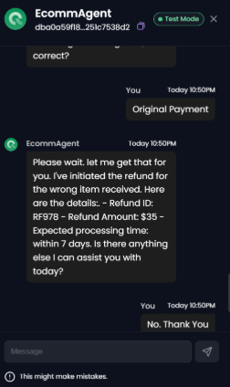
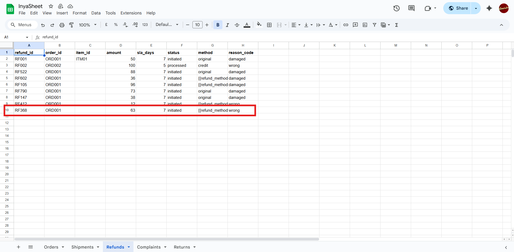

  

# Orderly - Inya.AI Buildathon 2025

## Overview
Orderly is an AI-powered support bot developed for the Inya.ai Buildathon 2025. The agent handles **order tracking, refunds, complaints, and returns** across **voice and chat**. It integrates custom APIs deployed on Render and leverages a JSON Knowledge Base (KB) for mock data. The bot authenticates users, retrieves and updates order information, creates service requests, and provides clear, actionable responses in a friendly and engaging tone.

Check out the live demo: [Youtube Link](https://youtu.be/SdECErtB47U)

---

## Features
- **Order Tracking**: Retrieve shipment status and ETAs via API.
- **Refund Handling**: Process refund requests and provide status updates.
- **Complaint Registration**: Create tickets with SLA and priority info.
- **Returns Management**: Handle return eligibility, schedule pickup, or provide drop-off options.
- **Multi-Channel Support**: Works across voice, chat, and SMS.
- **Error Handling & PII Masking**: Gracefully handles invalid IDs, timeouts, and masks sensitive user info.

---

## Setup Instructions
1. **Inya.ai Account**: Sign up at [app.inya.ai](https://app.inya.ai) and create a new agent.
2. **Render APIs**: Deploy custom APIs (`get_order`, `refunds`, `complaints`, `returns`) on Render (created on Sep 28, 2025).
3. **Knowledge Base Upload**: Upload `kb.json` as the KB in Inya.ai.
4. **Run Demo**: Test via the **Inya.ai Test tab**

---

## Configurations
- **System Prompt**: Defines agent role, supported intents (`track_order`, `initiate_refund`, `register_complaint`, `create_return`), and API simulation rules.
- **Agent Details**: Named `"EcomSupportAgent"` with e-commerce support focus.
- **Conversation Flow**: Greeting (`"Welcome to EcomSupport!"`), ending message, and pre-call variables such as `order_id`.
- **Transcriber**: Gnani Transcriber enabled with barge-in support.
- **LLM Model**: OpenAI model with temperature `0.5`, max tokens `300`, linked to KB.
- **Voice**: Natural TTS, supports barge-in.
- **Analytics**: Disposition tracking (`Resolved`, `Escalated`) and post-call triggers enabled.

---

## Integrations
- **Custom APIs on Render**:
  - `get_order` & `tracking`: Retrieve order & shipment details.
  - `refunds`: Process and track refund requests.
  - `complaints`: Register and track complaint tickets.
  - `returns`: Handle returns eligibility, schedule pickup/drop-off.

---

## Actions
- **track_order**: On-call action linked with `get_order` API to provide order status updates.
- **initiate_refund**: On-call action integrated with `refunds` API for refund processing.
- Both actions use variables (e.g., `order_id`, `status`) and trigger flows for Twilio SMS notifications.

---

## Example Queries  

You can ask **Orderly** the following types of queries:  

1. Give me order details of order: `ORD001`  
2. Give me tracking ID of order `ORD001`  
3. Give me the items in order `ORD001`  
4. Give me ETA for `ORD001`  
5. Initiate a refund for `ORD001`  
6. Register a complaint for `ORD001`  
7. Call your customer support agent  

---

## Output Images

---

## Contributing
- Fork the repo, create a branch, make your changes, and submit a pull request.
- Ensure API endpoints and KB references are correctly linked when updating flows.

---

## License
This project is for **Inya.ai Buildathon 2025** purposes and may not be used commercially without permission.

---

## Contact
For questions or collaboration:  
- Email: teaminspire2226@gmail.com 
- LinkedIn: [Tejas Gadge](https://www.linkedin.com/in/tejas-gadge-8a395b258/) & [Anisha Shankar](https://www.linkedin.com/in/anisha-shankar-/)

